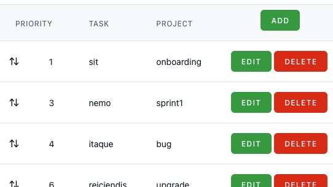

# Todo-Livewire


`To Do` is the classic `Hello World` example for JavaScript frameworks. This
demo is written in Livewire, to be as Laravel / PHP as possible. State is
saved to server, unlike many other ToDo demos.



## Requirements

- Git >= 2
- Node.js >= 22
- PHP >= 8.3
- Composer >= 2.8

## Installation

```bash
cd ~
git clone https://github.com/bingalls/todo-livewire.git
cd todo-livewire
composer install
npm install
npm run build
cp .env .env.example
php artisan key:generate
php artisan migrate --seed
php artisan serve
open http://127.0.0.1:8000/     # MacOS to open in default browser
```

## Tests

These tests are suitable for your ci/cd

```bash
composer validate
composer diagnose
composer audit
npm audit
npm doctor
# markdownlint README.md    # tool not included
./vendor/bin/pint --test
./vendor/bin/phpstan analyse
./vendor/bin/pest
./vendor/bin/phpinsights
```

## License & Credits

`Todo-Livewire` is open-sourced software licensed under the
[MIT license](https://opensource.org/licenses/MIT).

It is made possible with the hard work & licenses from the following contributors:

- Adam Wathan
- Freek Van Der Herten & Spatie
- Jeffrey Way
- Mohammed Said
- Nuno Maduro
- Povilas Korop
- Taylor Otwell
